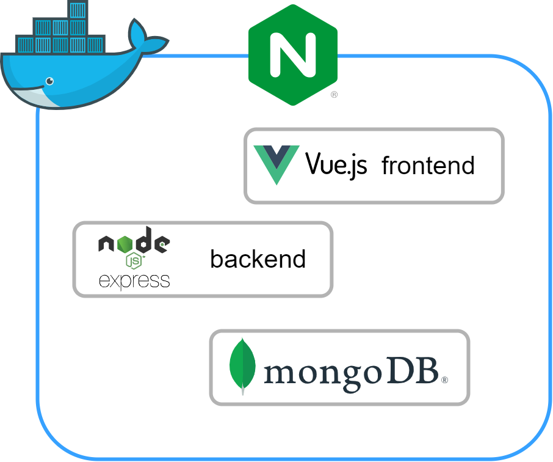

# reisekostenabrechnung

Reisekostenabrechnung inkl. automatischer Pauschalen Berechnung auch für internationale Reisen

## Pauschalbeträge

- Deutschland: Verpflegung [§9 Abs. 4a S. 3 EStG](https://www.gesetze-im-internet.de/estg/__9.html) - Übernachtung [§7 Abs. 1 BRKG](https://www.gesetze-im-internet.de/brkg_2005/__7.html)
- Andere Länder:  [Steuerliche Behandlung von Reisekosten und Reisekostenvergütungen](https://www.bundesfinanzministerium.de/Content/DE/Downloads/BMF_Schreiben/Steuerarten/Lohnsteuer/2022-11-23-steuerliche-behandlung-reisekosten-reisekostenverguetungen-2023.pdf)

## Schema

